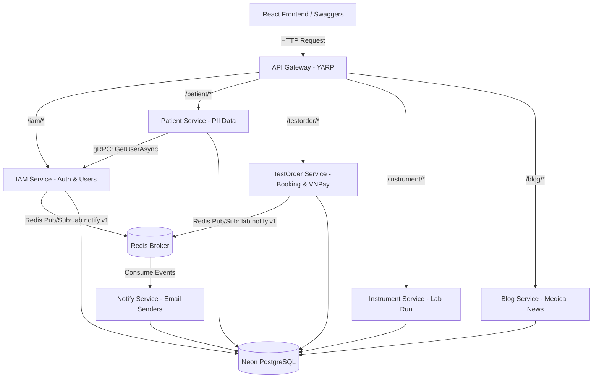

# HemaLink - Hệ Thống Quản Lý Xét Nghiệm Y Khoa Trực Tuyến

HemaLink là một giải pháp phần mềm phân tán, hiện đại được thiết kế để số hóa và tối ưu hóa quy trình quản lý phòng xét nghiệm y khoa (đặc biệt là xét nghiệm máu). Hệ thống hỗ trợ đắc lực cho cả bệnh nhân (đặt lịch, thanh toán, xem kết quả, nhờ AI tư vấn) và nhân viên y tế (quản lý máy xét nghiệm, nhập kết quả hàng loạt bằng file CSV, kiểm duyệt nội dung y khoa).

Hệ thống được phát triển trên nền tảng kiến trúc Microservices phân tán mạnh mẽ sử dụng hệ sinh thái **.NET 8** và **React (Vite)** cho Frontend.

---

## 🗺️ Kiến Trúc Hệ Thống (System Architecture)

Hệ thống được tổ chức theo kiến trúc **Microservices** phân hợp nhất qua một **API Gateway** trung tâm. Các dịch vụ độc lập giao tiếp qua **gRPC** (truy vấn đồng bộ hiệu năng cao) và **Redis Pub/Sub** (truyền thông báo bất đồng bộ).



### Chi tiết các Service:
1. **API Gateway (YARP):** Cổng định tuyến duy nhất, gom các API riêng lẻ thành một mối, xử lý CORS và điều phối request.
2. **IAM Service (Identity & Access Management):** Quản lý tài khoản, phân quyền dựa trên vai trò (RBAC) với Dynamic Policy, cấp phát JWT.
3. **Patient Service:** Quản lý hồ sơ bệnh nhân. Dữ liệu nhạy cảm cá nhân (PII) như CMND/CCCD, SĐT được mã hóa tự động ở tầng database bằng thuật toán **AES-GCM**.
4. **TestOrder Service:** Đặt lịch hẹn, quản lý danh mục xét nghiệm, tích hợp cổng thanh toán **VNPay**, và tích hợp **Google Gemini AI** để phân tích, đưa ra lời khuyên dựa trên chỉ số xét nghiệm.
5. **Instrument Service:** Quản lý trang thiết bị xét nghiệm và các lượt vận hành máy (Run). Xử lý kết quả thô từ máy.
6. **Blog Service:** Quản lý bài viết kiến thức y khoa, danh mục, bình luận và nhãn (Tag).
7. **Notify Service:** Lắng nghe sự kiện qua Redis, tự động gửi email thông báo (SMTP) xác nhận lịch hẹn, đổi mật khẩu cho bệnh nhân.

---

## 🛠️ Công Nghệ Sử Dụng (Technology Stack)

### Backend:
* **Framework:** ASP.NET Core (.NET 8.0)
* **ORM:** Entity Framework Core
* **Database:** PostgreSQL (Neon.tech cho môi trường Cloud)
* **Message Broker:** Redis Pub/Sub (StackExchange.Redis)
* **Communication:** gRPC (Inter-service communication)
* **AI Integration:** Google Gemini AI (Gemini 2.5 Flash API)
* **Payment Gateway:** VNPay Integration
* **Security:** JWT Authentication, Dynamic RBAC, Cryptography (AES-GCM)

### Frontend:
* **Framework:** React.js (Vite)
* **Styling:** TailwindCSS, Vanilla CSS, Material UI / Shadcn components
* **HTTP Client:** Axios (xử lý gắn Token tự động và Refresh Token)

---

## 🚀 Hướng Dẫn Cài Đặt Cục Bộ (Local Installation Guide)

### Yêu cầu hệ thống:
* Đã cài đặt **.NET 8.0 SDK** hoặc mới hơn.
* Đã cài đặt **Node.js** (phiên bản 18+).
* Đã cài đặt **Docker & Docker Desktop**.

### Các bước chạy hệ thống bằng Docker:

1. **Clone dự án về máy:**
   ```bash
   git clone <URL_REPO>
   cd laboratory-management
   ```

2. **Khởi chạy cơ sở dữ liệu và các Container dịch vụ:**
   Di chuyển vào thư mục backend và chạy Docker Compose:
   ```bash
   cd Laboratory_Management/Backend/LabolaryManagement
   docker-compose up --build -d
   ```
   Lệnh này sẽ tải và khởi tạo:
   * **PostgreSQL Database** (cổng `5432`)
   * **Redis Service** (cổng `6379`)
   * **7 Microservices Backend** và **API Gateway** (cổng `8080`)

3. **Cài đặt và chạy Frontend:**
   Mở một terminal mới ở thư mục gốc dự án:
   ```bash
   cd Laboratory_Management/Frontend/BloodTest
   npm install
   npm run dev
   ```
   Frontend sẽ khởi chạy tại địa chỉ: `http://localhost:5174/` hoặc `http://localhost:5173/`.

---

## ☁️ Triển Khai Lên Render (Cloud Deployment Instructions)

Hệ thống đã được tối ưu cấu hình để deploy lên đám mây Render (Free Tier) bằng Blueprint:

1. Tạo các database độc lập trên **Neon.tech** (`LabIAM`, `PatientService4`, `TestOrderDB`, `BlogServiceDB`, `InstrumentDB`, `notify`).
2. Đẩy dự án lên GitHub cá nhân/tổ chức.
3. Trên dashboard của Render, chọn **New -> Blueprint**. Kết nối với Repo GitHub của bạn.
4. Render sẽ đọc file [render.yaml](file:///d:/Learning/Ki_8/PRM393/laboratory-management/render.yaml) để tự động cấu hình **7 Web Services** và **1 Private Redis Service**.
5. Điền đầy đủ các thông số connection string của Neon database và Gmail App Password khi được yêu cầu trên giao diện Render.

---

## 👥 Phân Công Nhiệm Vụ (Team Member Responsibilities)

| Thành viên | Vai trò | Nhiệm vụ chính đảm nhận |
| :--- | :--- | :--- |
| **Nguyễn Văn A** (Ví dụ) | Team Leader / Backend | Thiết kế kiến trúc Microservices, gRPC, IAM Service, và API Gateway. |
| **Trần Thị B** (Ví dụ) | Backend Developer | Phát triển Patient Service (Mã hóa AES-GCM PII), TestOrder & Tích hợp VNPay. |
| **Lê Văn C** (Ví dụ) | Frontend Developer | Xây dựng giao diện React, tích hợp API Gateway, quản lý State và JWT Token. |
| **Phạm Văn D** (Ví dụ) | DevOps / Tester | Cấu hình Docker Compose, viết tài liệu deploy Render và chạy thử nghiệm hệ thống. |
