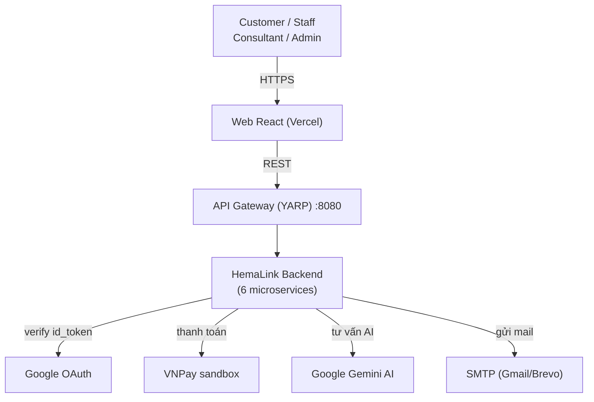
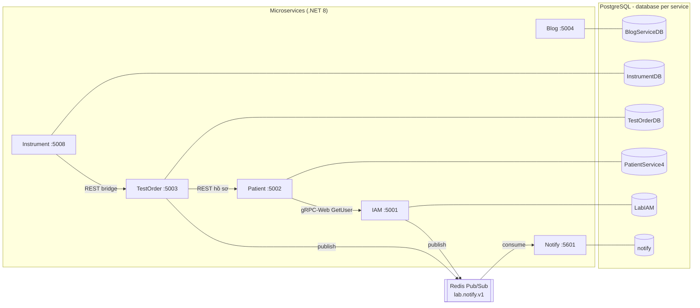
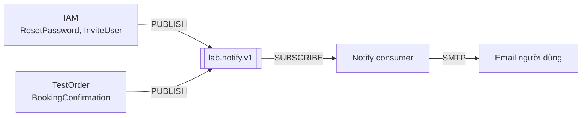
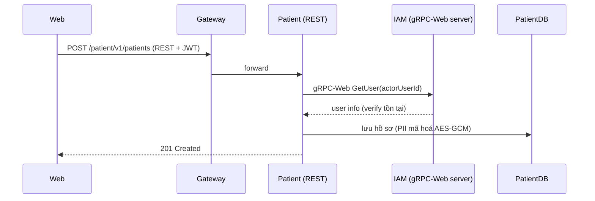
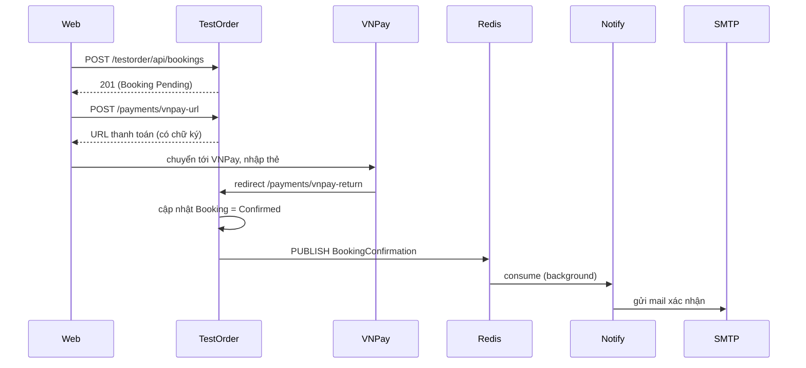
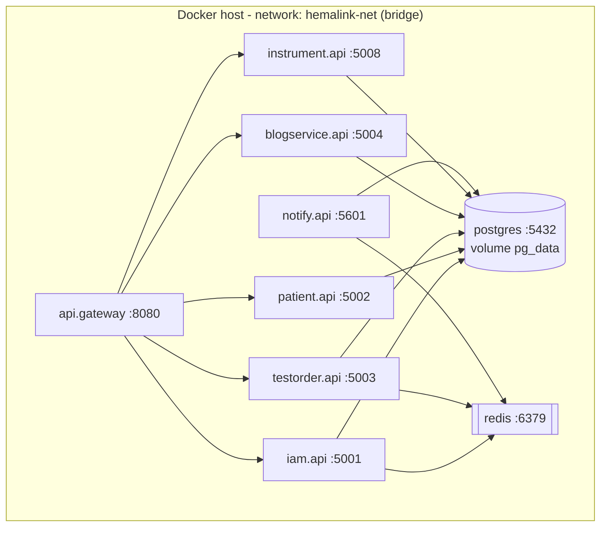

# Kiến trúc hệ thống HemaLink — Laboratory Management

Tài liệu mô tả kiến trúc theo 3 view: **System Context**, **Runtime**, **Deployment**.
Mọi sơ đồ và số liệu trong tài liệu này đối chiếu trực tiếp với mã nguồn và file cấu hình
triển khai thực tế (đường dẫn file + số dòng được ghi ở phần *Minh chứng* của từng mục).

---

## 1. System Context View

### 1.1 Mô tả

HemaLink là hệ thống quản lý phòng xét nghiệm y khoa, cho phép bệnh nhân đặt lịch — thanh toán —
xem kết quả, và cho nhân viên phòng lab vận hành máy xét nghiệm, kiểm duyệt nội dung.

Người dùng truy cập hệ thống qua **web React (Vercel)** → gọi vào **API Gateway (YARP)** duy nhất,
gateway định tuyến tới các microservice backend. Hệ thống kết nối 4 dịch vụ bên thứ ba.

### 1.2 Actors (tác nhân)

| Actor | Vai trò | Xác định trong code |
|---|---|---|
| **Customer** | Bệnh nhân: đặt lịch, thanh toán, xem kết quả, nhờ AI tư vấn | Role `Customer` — gán mặc định khi đăng ký |
| **Staff** | Nhân viên: check-in bệnh nhân | Quyền `Booking.Update.CheckIn` |
| **Consultant** | Kỹ thuật viên: chạy máy sinh kết quả | Màn hình Instrument Run |
| **Admin / Manager** | Quản trị: quản lý user, phân quyền, kiểm duyệt | Quyền `User.*`, `Role.*` |

RBAC động: controller khai báo `[Authorize(Policy = "perm:XXX")]`, policy sinh tự động bởi
`Common/Authorization/DynamicAuthorizationPolicyProvider.cs`.

### 1.3 External Systems (hệ thống ngoài)

| Hệ thống | Dùng làm gì | Service | Minh chứng |
|---|---|---|---|
| **Google OAuth** | Đăng nhập bằng Google | IAM | `IAM.Application/Auth/Services/AuthService.Google.cs:28` |
| **VNPay (sandbox)** | Cổng thanh toán | TestOrder | `TestOrder.Application/Services/PaymentService.cs` |
| **Google Gemini 2.5 Flash** | AI phân tích chỉ số xét nghiệm | TestOrder | `TestOrder.Application/AIReview/Services/IAReviewService.cs:125` |
| **SMTP (Gmail / Brevo)** | Gửi email thông báo | Notify | `Messaging/Email/SmtpEmailSender.cs` |

### 1.4 Context Diagram



### 1.5 Minh chứng
- Route gateway: `APIGateway.Presentation/appsettings.json` (5 route: `/iam`, `/patient`, `/testorder`, `/blog`, `/instrument`)
- FE client ID Google: `Laboratory_Management_FE/src/main.jsx:12`

---

## 2. Runtime View

### 2.1 Service Catalog

Hệ thống có **6 microservice** + **1 API Gateway**. Mỗi service một database PostgreSQL riêng
(database-per-service).

| # | Service | Port | Chức năng chính | Database | Entry point |
|---|---|---|---|---|---|
| 1 | **API Gateway** | 8080 | Định tuyến YARP, CORS | — | `APIGateway.Presentation/Program.cs` |
| 2 | **IAM** | 5001 | Auth, JWT, RBAC, Google login, quên mật khẩu | `LabIAM` | `IAM.Presentation/Program.cs` |
| 3 | **Patient** | 5002 | Hồ sơ bệnh nhân, mã hoá PII (AES-GCM) | `PatientService4` | `Patient.Presentation/Program.cs` |
| 4 | **TestOrder** | 5003 | Đặt lịch, danh mục, VNPay, kết quả, AI review | `TestOrderDB` | `TestOrder.Presentation/Program.cs` |
| 5 | **Blog** | 5004 | Bài viết y khoa, danh mục, bình luận | `BlogServiceDB` | `BlogService.Presentation/Program.cs` |
| 6 | **Instrument** | 5008 | Quản lý máy, chạy máy sinh kết quả | `InstrumentDB` | `Instrument.Presentation/Program.cs` |
| 7 | **Notify** | 5601 | Consumer Redis, gửi email | `notify` | `Notify.Api/Program.cs` |

Mỗi service theo kiến trúc phân tầng: `Presentation → Application → Infrastructure → Domain`.

### 2.2 Communication Matrix

| Nguồn | Đích | Giao thức | Nội dung | Minh chứng (file:dòng) |
|---|---|---|---|---|
| Web | Gateway | REST/HTTPS | Toàn bộ request | `main.jsx` axios |
| Gateway | 5 service | REST (YARP) | Reverse proxy | `APIGateway.Presentation/appsettings.json` |
| Patient | IAM | **gRPC-Web** | `GetUser(userId)` xác thực người tạo hồ sơ | `Patient.Application/Services/PatientService.cs:106` |
| TestOrder | Patient | **REST** | `GET /v1/patients/internal/{id}` lấy hồ sơ in phiếu | `TestOrder.Application/Services/TestReportService.cs:201` |
| Instrument | TestOrder | **REST** | Bridge: lấy chỉ số + trả kết quả | `Instrument.Application/Services/RunService.cs:33, :84` |
| IAM | Notify | **Redis Pub/Sub** | `ResetPassword`, `InviteUser` | `AuthService.cs:381`, `UserService.cs:72` |
| TestOrder | Notify | **Redis Pub/Sub** | `BookingConfirmation` | `BookingService.cs:470` |

**3 hình thức giao tiếp:** gRPC-Web (1), REST nội bộ (2), Message Queue / Redis Pub/Sub (2).

### 2.3 Runtime Architecture Diagram



### 2.4 Background Workers

| Worker | Service | Loại | Việc | Minh chứng |
|---|---|---|---|---|
| `ExpiresBookingService` | TestOrder | Định kỳ (mỗi 1 phút) | Huỷ booking Pending quá 15 phút chưa thanh toán | `Services/Booking/ExpiresBookingService.cs` |
| `CsvIngestWorker` | TestOrder | Định kỳ | Quét thư mục CSV, nạp kết quả, archive | `Presentation/Workers/CsvIngestWorker.cs` |
| `RedisNotificationSubscriberService` | Notify | Sự kiện (subscribe) | Nhận message Redis, render template, gửi mail | `Notify.Api/Services/RedisNotificationSubscriberService.cs` |

Cả 3 kế thừa `BackgroundService`, đăng ký bằng `AddHostedService<>()`.

### 2.5 Event Publisher / Consumer (Message Broker)

- **Broker:** Redis Pub/Sub, kênh `lab.notify.v1`
- **Producer:** IAM (`IamRedisNotificationPublisher`), TestOrder (`RedisNotificationPublisher`) → `PUBLISH`
- **Consumer:** Notify (`RedisNotificationSubscriberService`) → `SUBSCRIBE`, có chống trùng qua
  `notification_jobs.message_id` + retry 3 lần (5s/15s/30s)



### 2.6 Sequence Diagram 1 — Tạo hồ sơ bệnh nhân (REST ↔ gRPC)



### 2.7 Sequence Diagram 2 — Đặt lịch → thanh toán VNPay → gửi mail



### 2.8 API Contract

- **REST:** mỗi service bật Swagger/OpenAPI (`UseSwagger` + `UseSwaggerUI`) trong `Program.cs` của
  5 service REST (IAM, Patient, TestOrder, Blog, Instrument). Notify là consumer nền, chỉ có
  `/healthz` nên không có Swagger.
  - Swagger local: `http://localhost:{port}/swagger`
  - Swagger cloud (qua gateway): `https://hemalink-gateway-5ils.onrender.com/{service}/swagger/index.html`
- **gRPC:** hợp đồng tại `Contracts/Grpc/iam/iam.proto`

```proto
service UserService {
  rpc GetUser (GetUserRequest) returns (GetUserReply);
}
```
  - Server: `IAM.Presentation/Grpc/UserService.cs` (`IamGrpcUserService`)
  - Client: `Patient.Presentation/Program.cs:109` (`UserServiceClient` qua `GrpcWebHandler`)

---

## 3. Deployment View

### 3.1 Mô tả

Hệ thống chạy được theo **2 cách**, đều dùng chung 7 Dockerfile:
- **Local:** Docker Compose — 9 container (7 service + PostgreSQL + Redis)
- **Cloud:** Render (7 web service Docker) + Neon (PostgreSQL) + Redis Cloud + Vercel (FE)

### 3.2 Containers & Port Mapping (Docker Compose)

| Container | Image / Build | Host:Container | Loại |
|---|---|---|---|
| `postgres` | postgres:16-alpine | 5432:5432 | Hạ tầng |
| `redis` | redis:7-alpine | 6379:6379 | Hạ tầng |
| `api.gateway` | gateway.Dockerfile | 8080:8080 | Service |
| `iam.api` | iam.Dockerfile | 5001:5001 | Service |
| `patient.api` | patient.Dockerfile | 5002:5002 | Service |
| `testorder.api` | testorder.Dockerfile | 5003:5003 | Service |
| `blogservice.api` | deployments/docker/BlogService.Dockerfile | 5004:5004 | Service |
| `instrument.api` | instrument.Dockerfile | 5008:5008 | Service |
| `notify.api` | deployments/docker/Notify.Dockerfile | 5601:5601 | Service |

→ **9 container** (7 tự build từ code + 2 kéo từ Docker Hub).

### 3.3 Docker Network

Tất cả container nối vào **1 network bridge tên `hemalink-net`** (khai báo tường minh cuối
`docker-compose.yml`). Nhờ đó các service gọi nhau bằng **tên container**:
- Patient → IAM: `http://iam.api:5001` (`Grpc__IamUrl`)
- Instrument → TestOrder: `http://testorder.api:5003` (`TestOrderBaseUrl`)
- Các service → DB: `Host=postgres`; → Redis: `redis:6379`

### 3.4 Docker Volumes

| Volume | Mount | Lưu dữ liệu |
|---|---|---|
| `pg_data` (named) | `/var/lib/postgresql/data` | Dữ liệu PostgreSQL (không mất khi tắt container) |
| bind mount | `./BlogService.Presentation/Images:/app/Images` | Ảnh bài viết blog |
| bind mount | `./Instrument.Presentation/Images:/app/Images` | Ảnh thiết bị |

### 3.5 Database / Redis triển khai ở đâu

| Thành phần | Local (Compose) | Cloud (Render) |
|---|---|---|
| PostgreSQL | Container `postgres` chứa 6 database logic | Neon (managed) |
| Redis | Container `redis` | Redis Cloud (managed) |
| **RabbitMQ** | **Không dùng** — hệ thống dùng Redis Pub/Sub thay cho message queue | — |

> Lưu ý: đề bài cho chọn Kafka **hoặc** Redis cho message broker; dự án chọn **Redis Pub/Sub**,
> nên không có RabbitMQ.

### 3.6 Deployment Diagram



### 3.7 Khởi động

```bash
cd Laboratory_Management/Backend/LabolaryManagement
docker-compose up --build -d
docker compose ps        # chụp màn hình 9 container đang chạy làm minh chứng
```

### 3.8 Minh chứng
- `Laboratory_Management/Backend/LabolaryManagement/docker-compose.yml` (9 service, network `hemalink-net`, volume `pg_data`)
- 7 Dockerfile (multi-stage build: tầng SDK build → tầng runtime chạy)
- `render.yaml` (blueprint deploy cloud)
- Ảnh chụp `docker compose ps` / Docker Desktop sau khi `up` — **cần chụp khi demo**

---

## Phụ lục — Đối chiếu nhanh với yêu cầu đề

| Yêu cầu | Đáp ứng | Vị trí |
|---|---|---|
| REST API, layered, JWT, phân trang | 6 service REST | Controllers + Program.cs |
| Background job | 3 worker | mục 2.4 |
| Message broker (producer + consumer) | Redis Pub/Sub, 2 producer + 1 consumer | mục 2.5 |
| gRPC, REST ↔ gRPC | Patient → IAM | mục 2.6 |
| Docker | 7 Dockerfile + compose | mục 3 |
| Cloud deployment | Render + Vercel + Neon + Redis Cloud | render.yaml |
